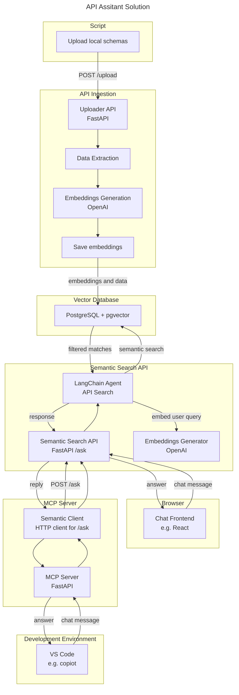
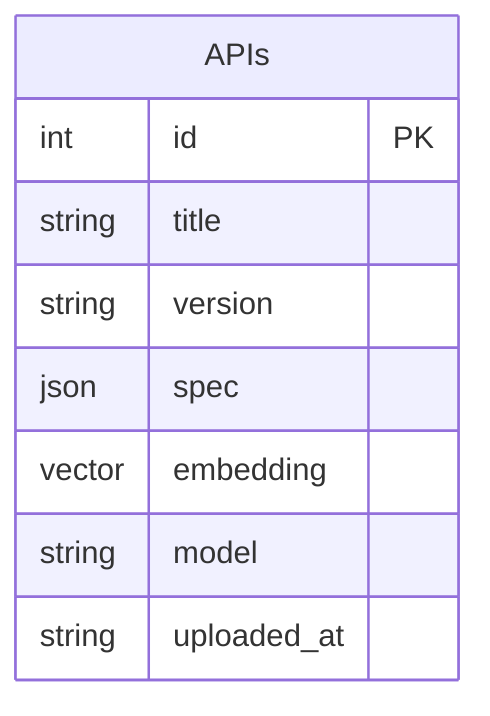

# api-assistant
AI Project Demo.

A FastAPI-based AI-powered service to **ingest**, **embed**, and **search OpenAPI specifications** using semantic similarity. This platform allows users to search and discover APIs by meaning, not just keywords.

## Purpose

Enable developers or systems to search across a catalog of OpenAPI specifications using **natural language** or **semantic intent**, powered by modern **embedding models**.

## Out-of-scope

- Authentication and Authorization
- Loging and audit
- Session management

## Example Flow

1. **User uploads** OpenAPI JSON/YAML.
2. Ingestion service:
   - Parses and normalizes the data.
   - Sends descriptions to the embedding engine.
   - Stores the resulting vectors in PgVector.
3. User performs a **semantic search query** via Webpage.
4. Query is embedded and compared to stored vectors.
5. Top-k similar API endpoints are returned.

## Solution

## Components

- **Client Script**  
  Read local OpenAPI specifications and upload to the system.
  
- **OpenAPI Ingestion Service (FastAPI)**  
  Accepts raw OpenAPI specs (JSON/YAML), parses endpoints, and extracts semantic descriptions.

- **Embedding Engine (via OpenAI API)**  
  Converts API endpoint descriptions into high-dimensional embeddings using models like `text-embedding-3-small`.

- **Vector Store (PostgreSQL + PgVector)**  
  Stores API metadata and endpoint embeddings in a relational and vector-aware format. Supports efficient similarity search.

- **Semantic Search API (AI Agent via FastAPI)**  
  Accepts user queries, converts them to embeddings, and retrieves the most relevant endpoints using cosine similarity.

- **Chat Frontend (Webpage powered by React)**  
  Allows users to interact with the search API using a web page.

- **MCP Server**  
  Allows AI agent to interact with the search API using the [Model Control Protocol (MCP)].

- **Developer Environment**  
  Visual studio code with copilot pluging configured in agent mode the connect to MCP Server using MCP.
  

## Model

| Table | Description |
|-------|-------------|
| `apis` | OpenAPI documents (name, version) |
| `api_endpoints` | Parsed endpoints (`GET /users`) |
| `embeddings` | Stores vector representation per endpoint |

Supports standard relational normalization and indexing for fast lookup.

*type* : summary, description, parameters, response schemas ...

This model can be improved to support multiple embeddings per API, key benefits are:

1. Embedding Versioning
    - re-embed content when:
      - Switch to a newer model (e.g., text-embedding-3-small → text-embedding-3-large)
      - Refine your embedding strategy (e.g., different preprocessing)

    - Historical embeddings allows:
       - Compare models - helps to ensure you're using the best embedding representation for your accuracy, performance, and cost trade-offs.
       - Re-rank results
       - Roll back mistakes

2. Fine-tuned Use Cases
    - You could store different embeddings for:
      - Endpoint description
      - Endpoint parameters
      - Endpoint response schemas

3. Multi-language Support
    - Embed descriptions in multiple languages if your API is multilingual.

## Technologies Used

| Layer | Tech |
|-------|------|
| API | FastAPI |
| Embedding | OpenAI Embeddings API |
| Vector Search | PgVector (PostgreSQL extension) |
| ORM | SQLAlchemy |
| CLI/Agent | MCP or Python script |
| Infra | Docker, Kubernetes/Kind |
