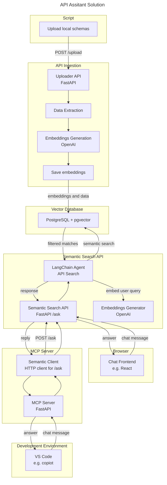
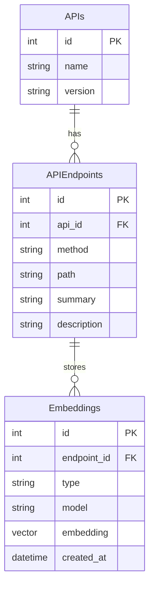

# api-assistant
AI Project Demo.

A FastAPI-based AI-powered service to **ingest**, **embed**, and **search OpenAPI specifications** using semantic similarity. This platform allows users to search and discover APIs by meaning, not just keywords.

## Purpose

Enable developers or systems to search across a catalog of OpenAPI specifications using **natural language** or **semantic intent**, powered by modern **embedding models**.

## Solution

## Components

- **Script**  
  Read local OpenAPI specifications and upload to the system.
  
- **OpenAPI Ingestion Service (FastAPI)**  
  Accepts raw OpenAPI specs (JSON/YAML), parses endpoints, and extracts semantic descriptions.

- **Embedding Engine (via OpenAI API)**  
  Converts API endpoint descriptions into high-dimensional embeddings using models like `text-embedding-3-small`.

- **Vector Store (PostgreSQL + PgVector)**  
  Stores API metadata and endpoint embeddings in a relational and vector-aware format. Supports efficient similarity search.

- **Semantic Search API (AI Agent via FastAPI)**  
  Accepts user queries, converts them to embeddings, and retrieves the most relevant endpoints using cosine similarity.

- **Chat Frontend (Webpage powered by React)**  
  Allows users to interact with the search API using a web page.

- **MCP Server**  
  Allows AI agent to interact with the search API using the [Model Control Protocol (MCP)].

- **Developer Environment**  
  Visual studio code with copilot pluging configured in agent mode the connect to MCP Server using MCP.
  

## Model

 type : summary, description, parameters, response schemas ...
